# 🚀 Complete System Flow Documentation

## 📋 Table of Contents
1. [System Architecture Overview](#system-architecture-overview)
2. [User Journey Flows](#user-journey-flows)
3. [API Interaction Patterns](#api-interaction-patterns)
4. [Authentication & Authorization Flow](#authentication--authorization-flow)
5. [Multi-Tenant Organization Flow](#multi-tenant-organization-flow)
6. [Payment & Subscription Flow](#payment--subscription-flow)
7. [Admin Panel Workflows](#admin-panel-workflows)
8. [Error Handling Patterns](#error-handling-patterns)

## 🏗️ System Architecture Overview

### Core Components
```
┌─────────────────┐    ┌─────────────────┐    ┌─────────────────┐
│   Frontend      │    │   Backend API   │    │   Database      │
│   (React/Vue)   │◄──►│   (Express.js)  │◄──►│   (PostgreSQL)  │
└─────────────────┘    └─────────────────┘    └─────────────────┘
                              │
                              ▼
                    ┌─────────────────┐
                    │  External APIs  │
                    │  • Stripe       │
                    │  • OAuth        │
                    │  • Email        │
                    └─────────────────┘
```

### Technology Stack
- **Backend**: Node.js + Express.js
- **Database**: PostgreSQL with Prisma ORM
- **Authentication**: JWT with refresh tokens
- **Payments**: Stripe integration
- **Documentation**: Swagger/OpenAPI 3.0
- **Security**: Helmet, CORS, Rate limiting

## 👤 User Journey Flows

### 1. New User Registration Flow
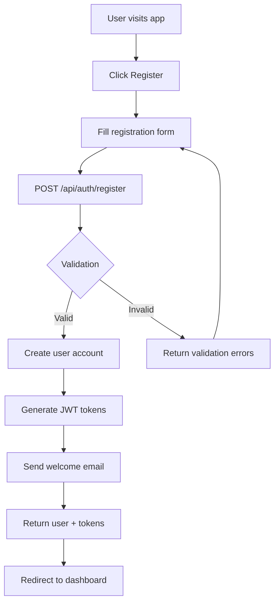

### 2. User Login Flow
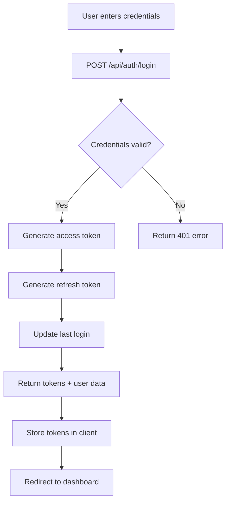

### 3. OAuth Authentication Flow
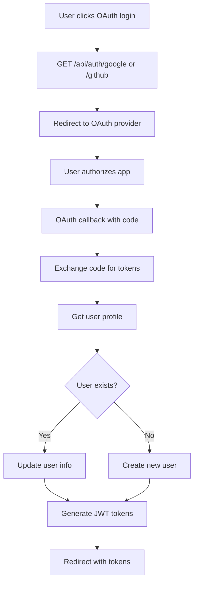

## 🏢 Multi-Tenant Organization Flow

### 1. Organization Creation Flow
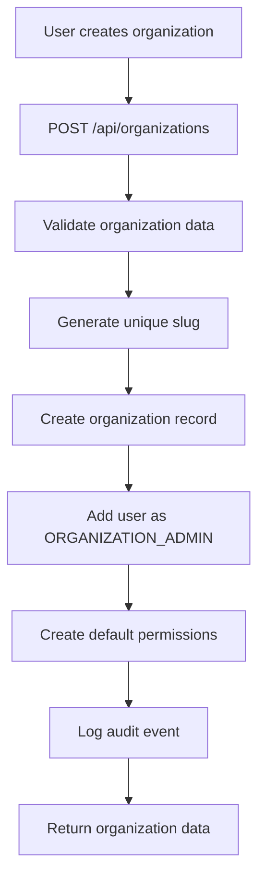

### 2. User Invitation Flow
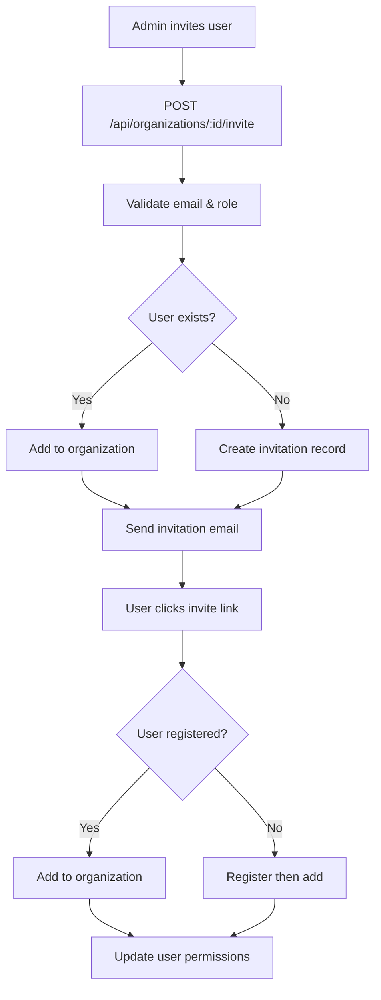

### 3. Role-Based Access Control
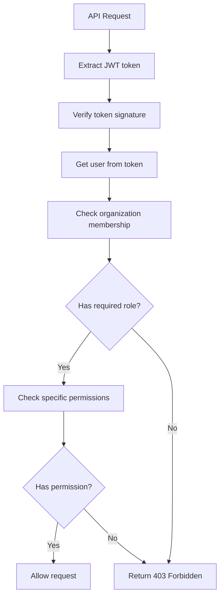

## 💳 Payment & Subscription Flow

### 1. Subscription Creation Flow
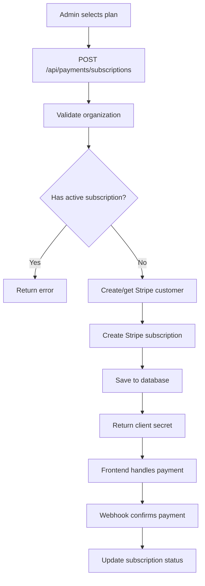

### 2. Webhook Processing Flow
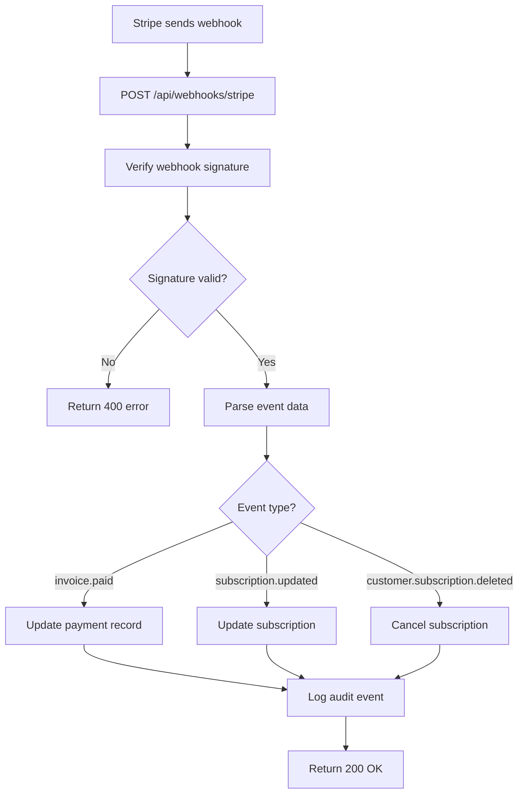

## 🔐 Authentication & Authorization Flow

### JWT Token Management
```mermaid
graph TD
    A[User logs in] --> B[Generate access token (15min)]
    B --> C[Generate refresh token (7 days)]
    C --> D[Store refresh token in DB]
    D --> E[Return both tokens]
    E --> F[Client stores tokens]
    F --> G[Use access token for requests]
    G --> H{Token expired?}
    H -->|No| I[Continue request]
    H -->|Yes| J[POST /api/auth/refresh]
    J --> K[Validate refresh token]
    K --> L[Generate new access token]
    L --> M[Return new token]
    M --> N[Retry original request]
```

### Permission Hierarchy
```
SUPER_ADMIN (Platform-wide access)
    ├── Can manage all organizations
    ├── Can view platform analytics
    ├── Can suspend/activate users
    └── Can access audit logs
    
ORGANIZATION_ADMIN (Organization-scoped)
    ├── Can manage organization settings
    ├── Can invite/remove members
    ├── Can manage subscriptions
    └── Can view organization analytics
    
ORG_MEMBER (Limited organization access)
    ├── Can view organization info
    ├── Can update own profile
    └── Can leave organization
    
USER (Basic access)
    ├── Can manage own profile
    └── Can create organizations
```

## 📊 Admin Panel Workflows

### 1. Organization Admin Dashboard
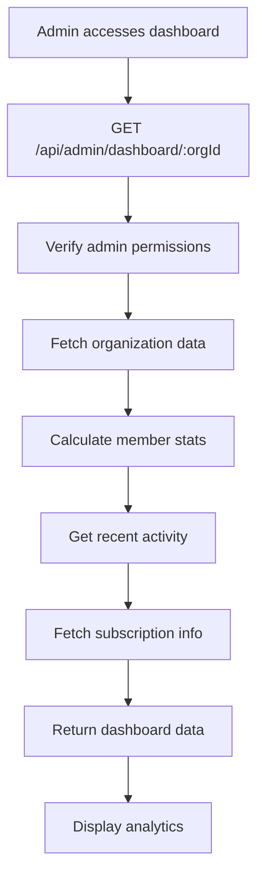

### 2. Super Admin Platform Overview
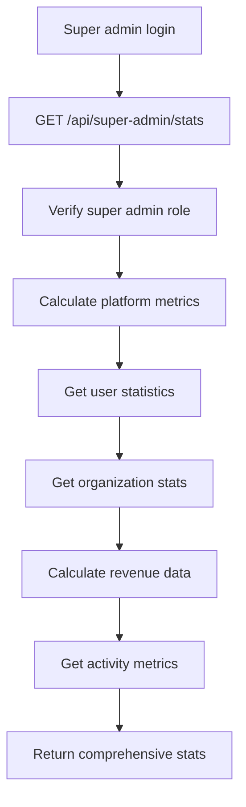

## 🚨 Error Handling Patterns

### Standard Error Response Format
```json
{
  "error": "Human-readable error message",
  "code": "MACHINE_READABLE_CODE",
  "details": [
    {
      "field": "email",
      "message": "Invalid email format"
    }
  ],
  "timestamp": "2024-01-20T15:30:00.000Z",
  "path": "/api/auth/register"
}
```

### Common Error Scenarios
1. **Authentication Errors** (401)
   - Invalid or expired JWT token
   - Missing authorization header
   - Revoked refresh token

2. **Authorization Errors** (403)
   - Insufficient permissions
   - Organization access denied
   - Role-based restriction

3. **Validation Errors** (400)
   - Invalid input data
   - Missing required fields
   - Business rule violations

4. **Resource Errors** (404)
   - User not found
   - Organization not found
   - Subscription not found

5. **Rate Limiting** (429)
   - Too many authentication attempts
   - API rate limit exceeded
   - Password reset limit reached

## 🔄 API Testing Flow

### Complete Testing Workflow
1. **Setup**: Start with user registration
2. **Authentication**: Get JWT tokens
3. **Authorization**: Test role-based access
4. **CRUD Operations**: Test all endpoints
5. **Error Scenarios**: Test validation and errors
6. **Integration**: Test payment flows
7. **Cleanup**: Test account deletion

### Swagger UI Testing Steps
1. Open `http://localhost:3000/api-docs`
2. Register new user via `/api/auth/register`
3. Copy access token from response
4. Click 🔒 Authorize button
5. Enter `Bearer YOUR_TOKEN`
6. Test all protected endpoints
7. Try different user roles and permissions

## 🎯 Complete API Endpoint Reference

### Authentication Endpoints (`/api/auth/`)
- `POST /register` - User registration with email/password
- `POST /login` - User login with credentials
- `POST /refresh` - Refresh JWT access token
- `POST /logout` - Logout and revoke refresh token
- `GET /google` - Initiate Google OAuth flow
- `GET /google/callback` - Handle Google OAuth callback
- `GET /github` - Initiate GitHub OAuth flow
- `GET /github/callback` - Handle GitHub OAuth callback
- `POST /forgot-password` - Request password reset email
- `GET /me` - Get current user information

### User Management Endpoints (`/api/users/`)
- `GET /profile` - Get user profile with organizations
- `PUT /profile` - Update user profile information
- `PUT /password` - Change user password
- `PUT /email` - Change user email address
- `DELETE /account` - Delete user account (deactivate)
- `GET /organizations` - Get user's organizations
- `DELETE /organizations/:id` - Leave organization

### Organization Management (`/api/organizations/`)
- `POST /` - Create new organization
- `GET /` - Get user's organizations
- `GET /:id` - Get organization details
- `PUT /:id` - Update organization settings
- `POST /:id/invite` - Invite user to organization
- `DELETE /:id/members/:userId` - Remove organization member

### Organization Admin Panel (`/api/admin/`)
- `GET /dashboard/:orgId` - Organization dashboard analytics
- `GET /members/:orgId` - Get organization members
- `PUT /members/:orgId/:userId/role` - Update member role
- `PUT /members/:orgId/:userId/deactivate` - Deactivate member
- `GET /audit-logs/:orgId` - Organization audit logs
- `GET /permissions/:orgId` - Available permissions

### Payment & Subscriptions (`/api/payments/`)
- `POST /subscriptions` - Create new subscription
- `GET /subscriptions/:orgId` - Get organization subscriptions
- `PUT /subscriptions/:id` - Update subscription
- `DELETE /subscriptions/:id` - Cancel subscription
- `POST /payment-intents` - Create one-time payment
- `POST /customer-portal` - Get Stripe customer portal URL
- `GET /payments/:orgId` - Get payment history

### Super Admin Platform (`/api/super-admin/`)
- `GET /analytics` - Platform-wide analytics
- `GET /users` - All platform users
- `GET /organizations` - All platform organizations
- `PATCH /users/:id/status` - Suspend/activate users
- `PATCH /organizations/:id/status` - Change organization status
- `GET /audit-logs` - Platform-wide audit logs

### Webhooks (`/api/webhooks/`)
- `POST /stripe` - Handle Stripe webhook events

## 🔄 Complete System Flow Diagram

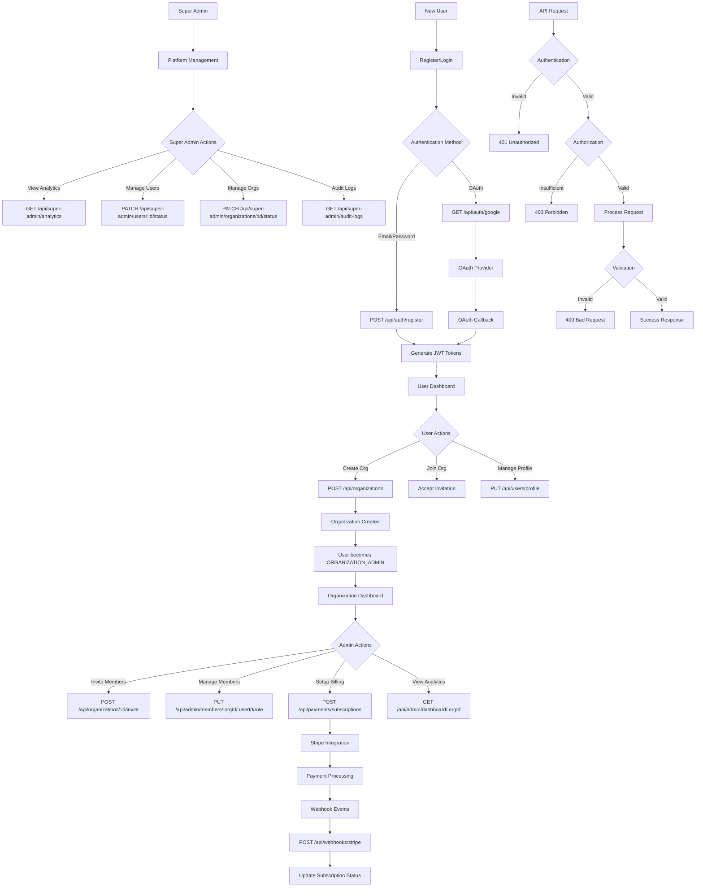

## 📊 Role-Based Access Matrix

| Endpoint | USER | ORG_MEMBER | ORGANIZATION_ADMIN | SUPER_ADMIN |
|----------|------|------------|-----------|-------------|
| `/api/auth/*` | ✅ | ✅ | ✅ | ✅ |
| `/api/users/profile` | ✅ | ✅ | ✅ | ✅ |
| `/api/organizations` (create) | ✅ | ✅ | ✅ | ✅ |
| `/api/organizations/:id` (read) | 🔒 | ✅ | ✅ | ✅ |
| `/api/organizations/:id` (update) | ❌ | ❌ | ✅ | ✅ |
| `/api/organizations/:id/invite` | ❌ | ❌ | ✅ | ✅ |
| `/api/admin/*` | ❌ | ❌ | ✅ | ✅ |
| `/api/payments/*` | ❌ | ❌ | ✅ | ✅ |
| `/api/super-admin/*` | ❌ | ❌ | ❌ | ✅ |

**Legend:**
- ✅ Full Access
- 🔒 Conditional Access (member of organization)
- ❌ No Access

## 🧪 Complete Testing Workflow

### 1. Setup Phase
```bash
# Start the server
npm run dev

# Open Swagger UI
http://localhost:3000/api-docs
```

### 2. Authentication Testing
```javascript
// Register new user
POST /api/auth/register
{
  "email": "test@example.com",
  "password": "TestPassword123!",
  "firstName": "Test",
  "lastName": "User"
}

// Copy accessToken from response
// Click 🔒 Authorize in Swagger
// Enter: Bearer YOUR_ACCESS_TOKEN
```

### 3. Organization Testing
```javascript
// Create organization
POST /api/organizations
{
  "name": "Test Company",
  "description": "A test organization"
}

// Get organization dashboard
GET /api/admin/dashboard/{organizationId}

// Invite member
POST /api/organizations/{organizationId}/invite
{
  "email": "member@example.com",
  "role": "ORG_MEMBER"
}
```

### 4. Payment Testing
```javascript
// Create subscription
POST /api/payments/subscriptions
{
  "priceId": "price_test_123",
  "organizationId": "{organizationId}"
}

// Get payment history
GET /api/payments/payments/{organizationId}
```

### 5. Super Admin Testing
```javascript
// Get platform analytics (requires SUPER_ADMIN role)
GET /api/super-admin/analytics

// Manage users
PATCH /api/super-admin/users/{userId}/status
{
  "isActive": false
}
```

This documentation provides a complete understanding of how the cleaning management system works, from user registration to payment processing, with clear API interaction patterns and testing workflows.
